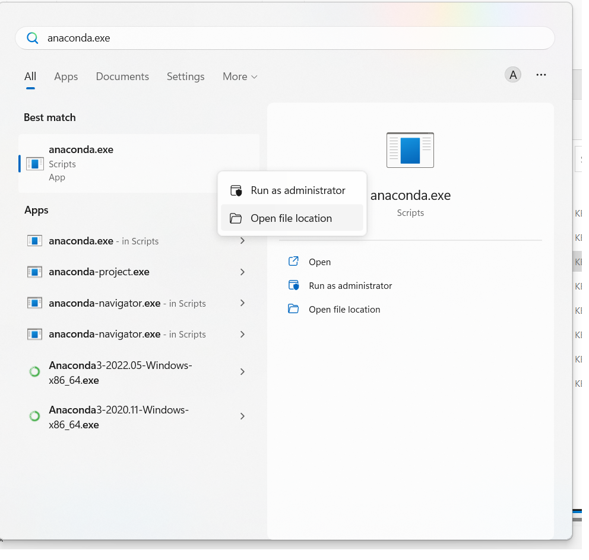

# AAA Project - Group: No Name

## Conda Command Cheat-Sheet

### Adding a new pyton package

First, make sure you have your environment activated:

```powershell
conda activate aaa
```

Then you can use the follwing command:

```powershell
conda install <package-name>
```

### Before commiting

Do this after adding a new python package:

```powershell
conda env export --from-history > environment.yml
```

### After pulling

When a new python package was added. You will know this when you either: 1) see changes in the environment.yml or 2) when running a notebook results in a missing package error.

```powershell
conda env update --file environment.yml --prune
```

A detailed overview about all conda commands can be found in the conda-cheat-sheet in the ./documents folder.

## Project Setup

To setup the project on your local machine, we will first setup [Conda](https://docs.conda.io/projects/conda/en/stable/index.html). It is a package management system, allowing us to all have the same version of python packets installed that are needed to run the notebooks.

### Conda Setup (For Win 10/11 + PowerShell)

To setup Conda, please install Anaconda as mentioned here: [Link](https://docs.conda.io/projects/conda/en/stable/user-guide/install/index.html)

Afterwards, locate your installation folder. Search for 'anaconda.exe' and open the file location as shown here:



You are now in your Anaconda folder. Here, move from the 'Scripts' (e.g. C:\path\to\anaconda-folder\anaconda3\scripts) folder to the 'condabin'-Folder (C:\path\to\anaconda-folder\anaconda3\condabin) and add this location to your path-Variable: [Link](https://www.computerhope.com/issues/ch000549.htm)

Then, you need to copy two files to enable SSL in Conda. Idk why this is not done by default, but here we are. Copy (make sure to not move them, as this could break your installation!) the two files:

```powershell
C:\Users{UserName}\anaconda3\Library\bin\libcrypto-1_1-x64.dll

C:\Users{UserName}\anaconda3\Library\bin\libssl-1_1-x64.dll
```

Then Paste them in this folder:

```powershell
C:\Users{UserName}\anaconda3\DLLs
```

Afterwards, restart you computer.

Lastly, run the following commands one after the other in your vsc powershell (STRG+J to open) while you are in your project directory:

```powershell
conda init powershell

//Restart VSC afterwards

conda create --name aaa
conda activate aaa

conda update conda
```
